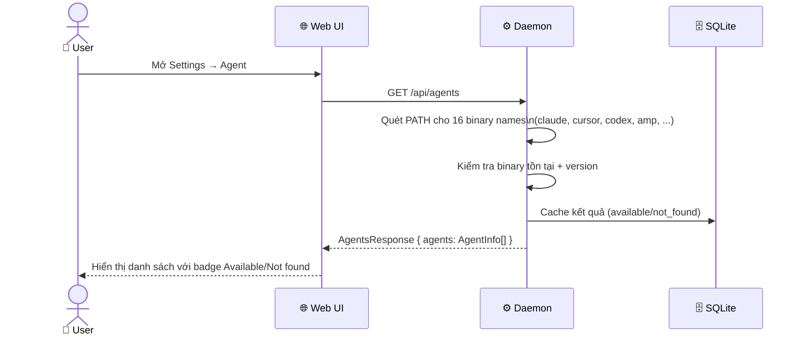
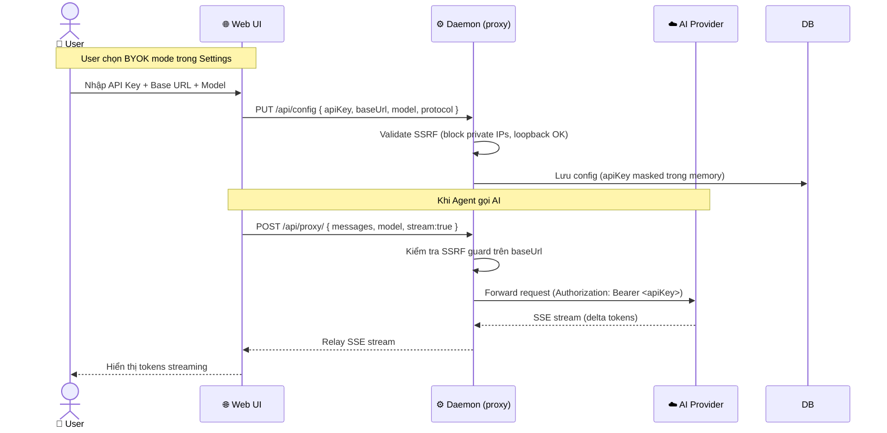
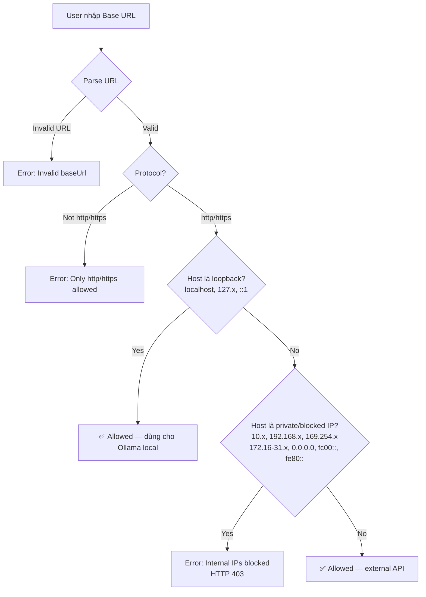
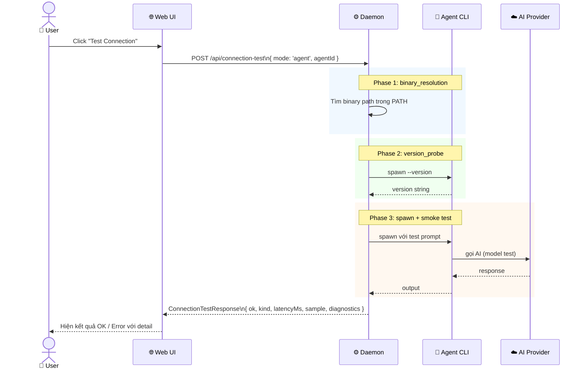
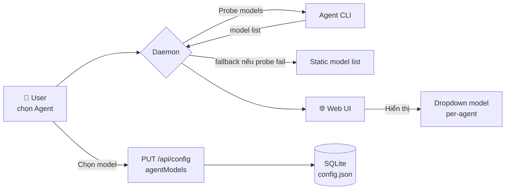

# DF-01: Agent System & BYOK Data Flow

**Feature:** Agent System — Multi-agent support, BYOK proxy, SSRF protection  
**Actors:** User, Web UI, Daemon, Agent CLI, AI Provider, SQLite DB, Filesystem

---

## 1. Agent Discovery Flow

---

## 2. BYOK API Proxy Flow

---

## 3. SSRF Validation Flow

---

## 4. Agent Connection Test Flow

---

## 5. Per-agent Model Selection Flow

---

## Data Store Map

| Data | Location | Schema |
|------|----------|--------|
| Agent availability cache | SQLite `config.json` | `{ agentId: { available, version, path } }` |
| BYOK API key | `config.json` | Plain text (not encrypted at rest) |
| Agent model prefs | `config.json` | `agentModels: Record<agentId, {model, reasoning}>` |
| Connection test result | In-memory (not persisted) | `ConnectionTestResponse` |

---

## Error Paths

| Scenario | Error | User Action |
|---------|-------|------------|
| Binary không tìm thấy | `agent_not_installed` | Hướng đến `installUrl` |
| Auth thiếu (API key) | `agent_auth_required` | Cấu hình credentials |
| SSRF blocked | `forbidden` | Dùng public URL |
| Rate limited | `rate_limited` | Chờ hoặc nâng plan |
| Provider down | `upstream_unavailable` | Retry sau |
