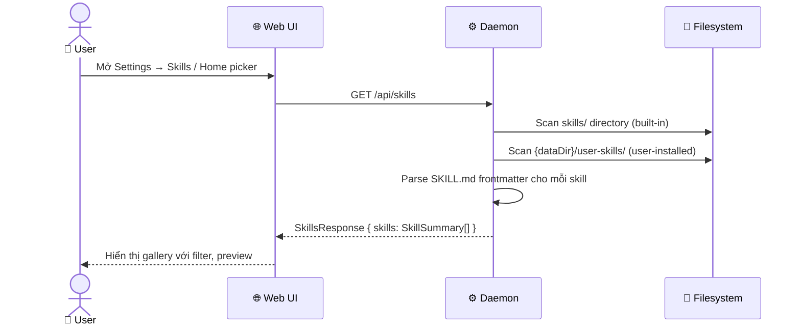
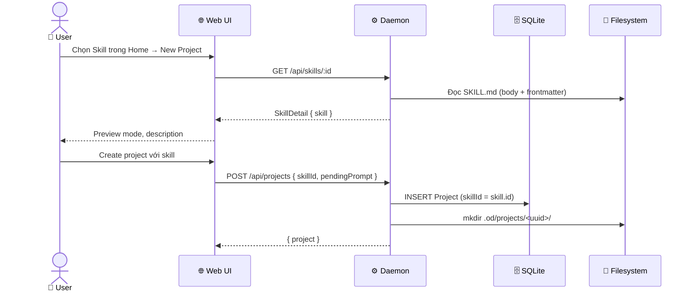
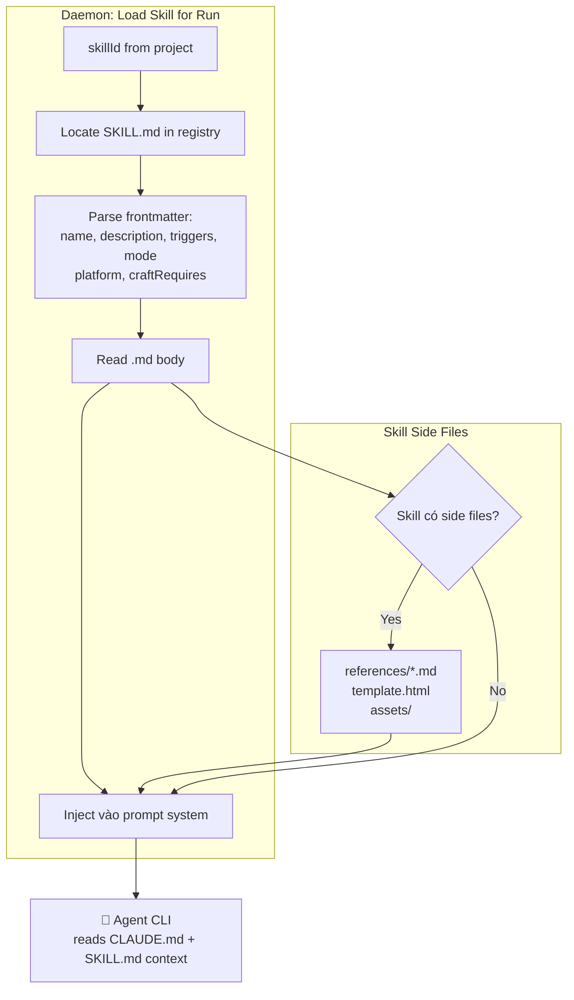
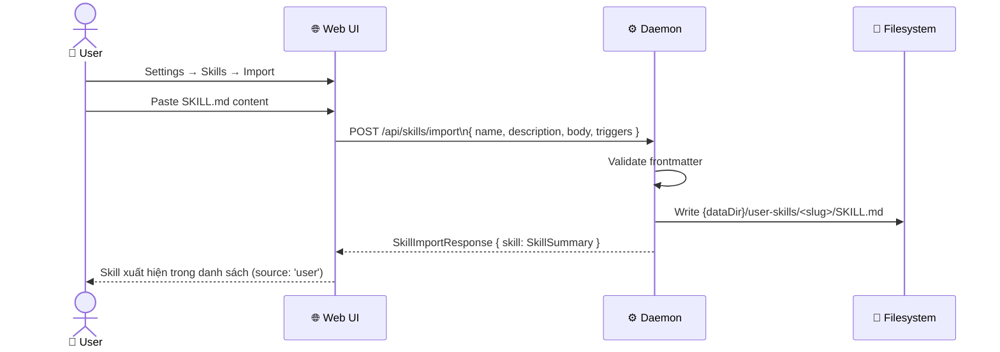
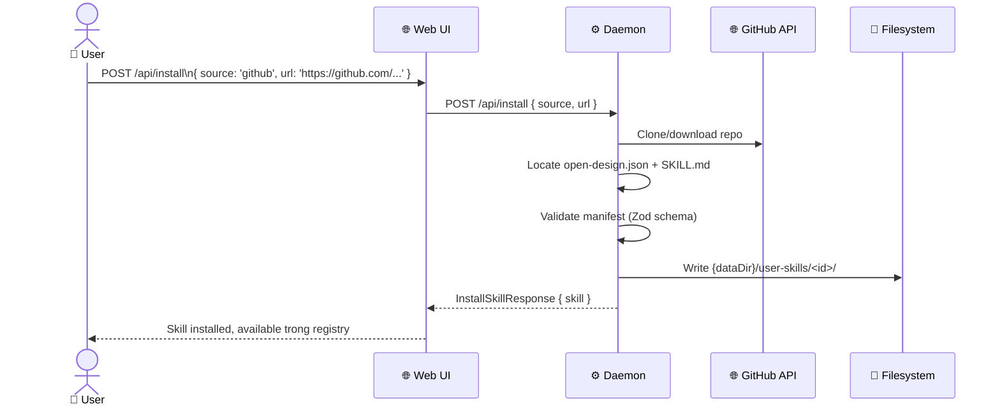
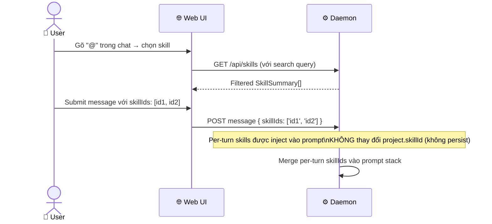

# DF-02: Skills System Data Flow

**Feature:** Skills — Prompt template library, SKILL.md system, Design Templates  
**Actors:** User, Web UI, Daemon, Agent CLI, Filesystem

---

## 1. Skill Discovery & Listing



---

## 2. Skill Selection & Apply to Project



---

## 3. SKILL.md Injection vào Prompt Stack



---

## 4. User Skill Import Flow



---

## 5. Skill Install từ GitHub



---

## 6. Design Templates vs Skills

```mermaid
flowchart LR
    subgraph REGISTRY["Registry Layer"]
        S[Skills\nmode: prototype/deck/image...] 
        DT[Design Templates\n= SkillSummary shape\nSeparate root in FS]
    end

    subgraph UI_SURFACE["UI Surfaces"]
        HOME[Home — New Project\nChip Rail]
        SETTINGS_SKILLS[Settings → Skills]
        SETTINGS_TEMPLATES[Settings → Templates\n(separate list)]
        EXAMPLES[Examples Gallery\nscenario-derived cards]
    end

    S --> HOME
    S --> SETTINGS_SKILLS
    S --> EXAMPLES
    DT --> SETTINGS_TEMPLATES
    DT --> HOME
```

---

## 7. @-mention Skill (Per-turn override)



---

## Data Store Map

| Data | Location | Notes |
|------|----------|-------|
| Built-in skills | `skills/` in repo | Read-only |
| User skills | `{dataDir}/user-skills/<id>/SKILL.md` | Mutable, delete allowed |
| Active skill ID | SQLite `projects.skillId` | Persisted per project |
| Disabled skills | `config.json → disabledSkills[]` | Global preference |
| Skill body cache | In-memory | Không cache to disk |
