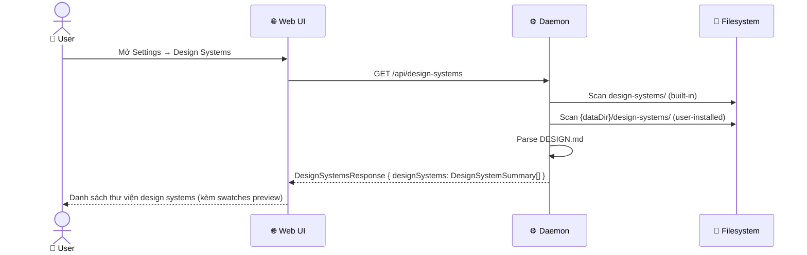
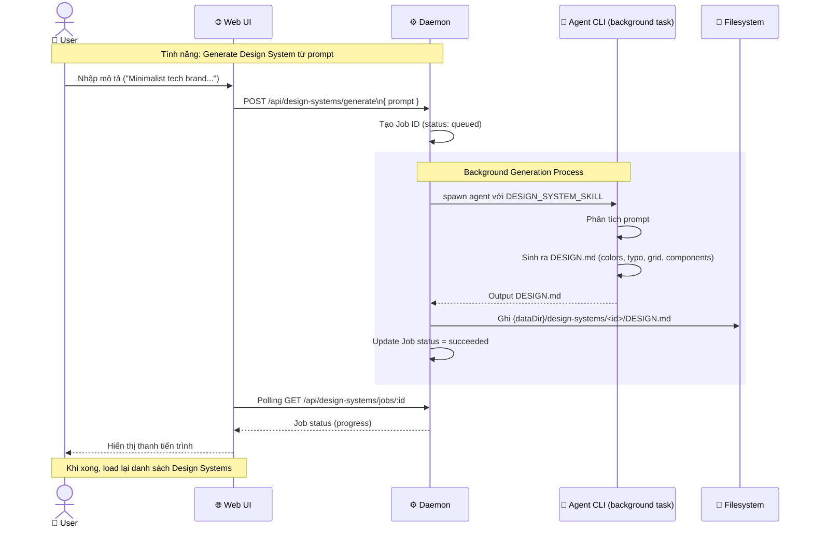
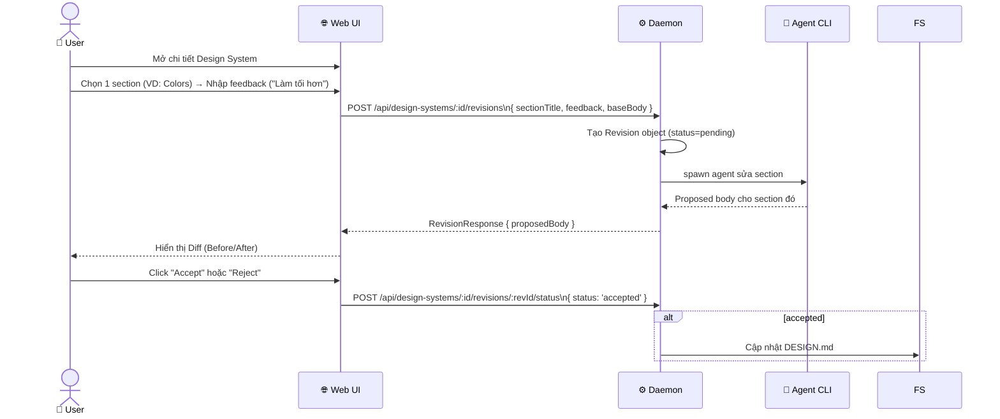

# DF-03: Design Systems Data Flow

**Feature:** Design Systems Library — Quản lý, apply và tạo mới (via agent) design systems  
**Actors:** User, Web UI, Daemon, SQLite DB, Filesystem, AI Provider (cho generation/review)

---

## 1. Design System Discovery & Selection



---

## 2. Apply Design System vào Project

```mermaid
flowchart TD
    U[User chọn Design System] --> W[Web UI]
    W -->|POST /api/projects { designSystemId }| D[Daemon]
    D --> DB[(SQLite\nprojects.designSystemId)]
    
    subgraph RUN_PREP["Run Preparation (Chat Turn)"]
        D2[Daemon] -->|Đọc| FS[Filesystem\nDESIGN.md]
        FS --> EXTRACT[Trích xuất rules, tokens, conventions]
        EXTRACT --> INJECT[Inject vào Prompt Stack (Vị trí ③)]
    end
    
    DB --> D2
```

---

## 3. Tạo/Cập nhật Design System (via AI Agent)



---

## 4. Design System Review Workflow (Section Revision)



---

## 5. Import Design System từ Local / GitHub

```mermaid
flowchart TD
    U[User] --> W[Web UI]
    W -->|POST /api/import-design-system| D[Daemon]
    
    D --> CHK{Nguồn?}
    CHK -->|Local| LOC[Đọc folder nội bộ]
    CHK -->|GitHub| GH[Git clone / download ZIP]
    
    LOC --> PARSE
    GH --> PARSE
    
    PARSE[Parse files:\nCSS/Tailwind tokens\nReact components\nFigma exports] --> ASSEMBLE[Tổng hợp thành DESIGN.md]
    
    ASSEMBLE --> FS[(Filesystem\n{dataDir}/design-systems/)]
    FS --> RES[Trả về DesignSystemSummary]
```

---

## Data Store Map

| Data | Location | Notes |
|------|----------|-------|
| Built-in DS | `design-systems/` | Read-only (`DESIGN.md`) |
| User DS | `{dataDir}/design-systems/<id>/` | Mutable |
| Active DS ID | SQLite `projects.designSystemId` | Persisted per project |
| DS Revisions | SQLite `ds_revisions` | Lịch sử đề xuất thay đổi |
| DS Jobs | SQLite `ds_jobs` | Tracking tiến độ tạo/sửa DS |
