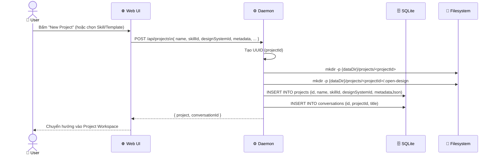
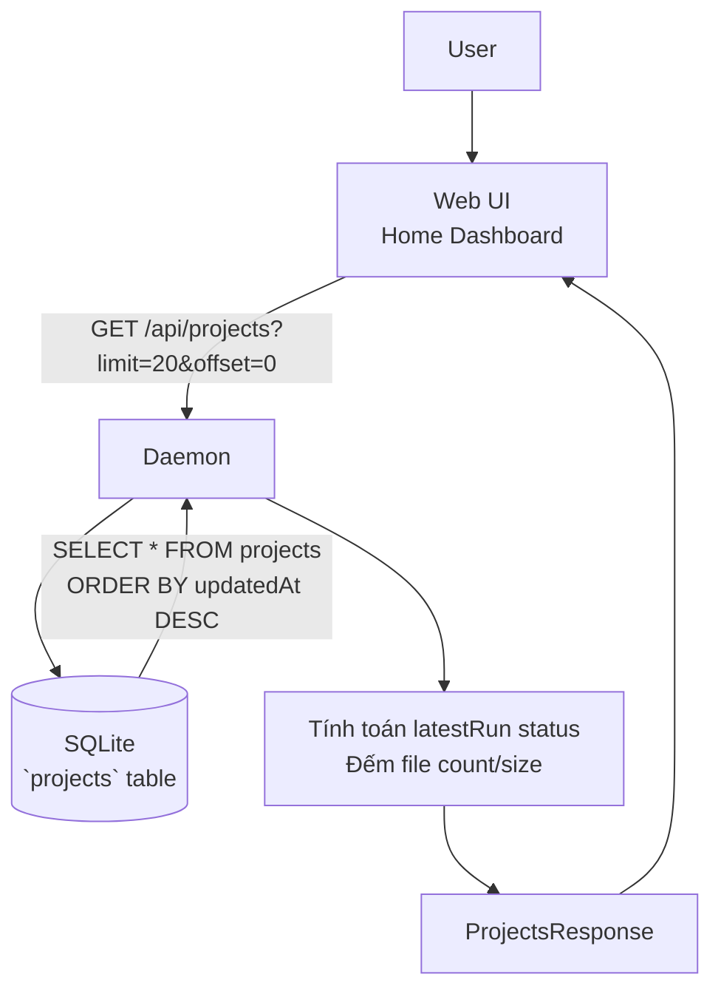
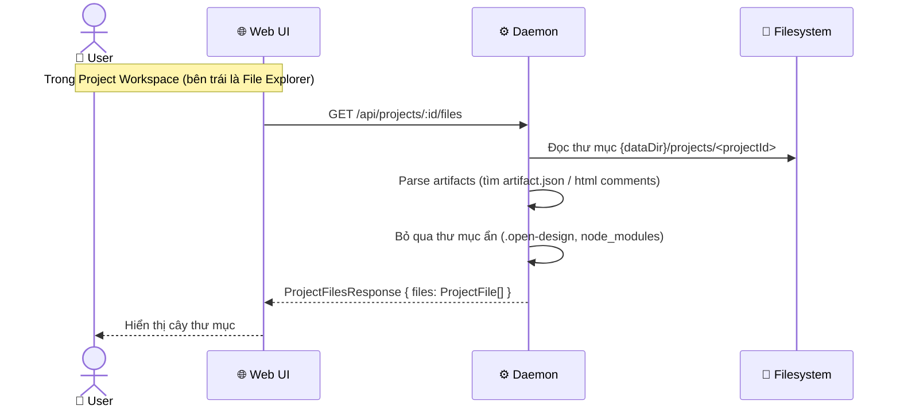
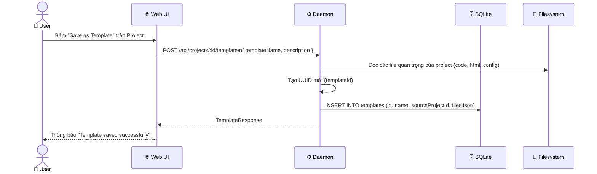

# DF-04: Project Management Data Flow

**Feature:** Project Management — Quản lý vòng đời project, folder structures, metadata  
**Actors:** User, Web UI, Daemon, SQLite DB, Filesystem

---

## 1. Project Creation Flow



---

## 2. Project List & Pagination Flow



---

## 3. Project File Tree Sync Flow



---

## 4. Save as Template Flow



---

## 5. Project Deletion Flow

```mermaid
flowchart TD
    U[User] -->|Click Delete Project| W[Web UI]
    W -->|DELETE /api/projects/:id| D[Daemon]
    
    D --> DB_DEL[(SQLite)]
    DB_DEL -->|DELETE FROM projects\nCASCADE conversations/messages| D
    
    D --> FS_DEL[(Filesystem)]
    FS_DEL -->|rm -rf {dataDir}/projects/<projectId>| D
    
    D --> W_RES[HTTP 200 OK]
    W_RES --> W
```

---

## Data Store Map

| Data | Location | Notes |
|------|----------|-------|
| `Project` | SQLite `projects` table | Chứa `metadataJson` cấu hình chi tiết |
| Project files | Filesystem `{dataDir}/projects/<id>/` | Source of truth cho file nội dung |
| Artifact metadata | Embedded trong file (`artifact.json` hoặc HTML comments) | Được parse khi list files |
| `Conversation` | SQLite `conversations` table | Liên kết 1-n với Project (thực tế 1-1 ở v1) |
| Templates | SQLite `templates` table | Chứa `filesJson` snapshot |
