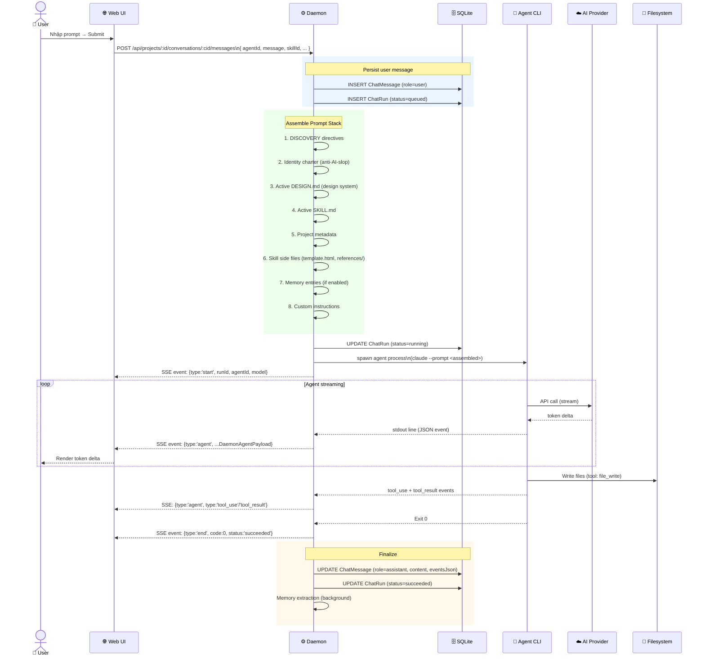
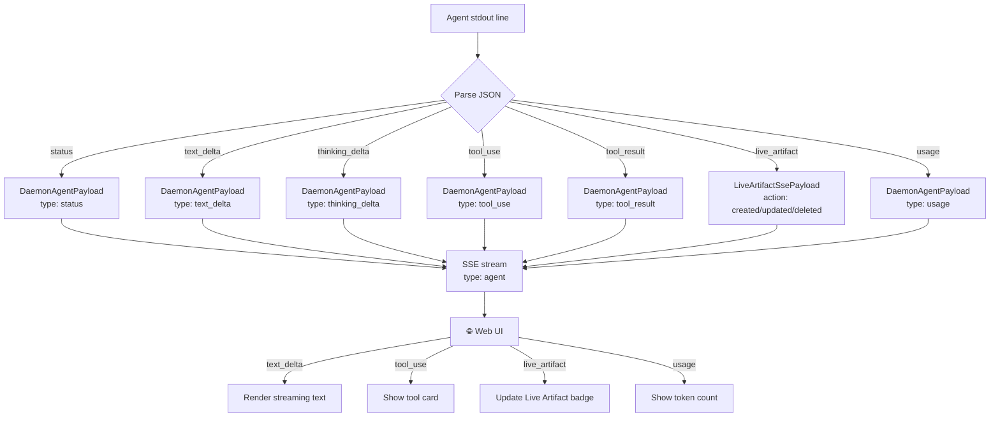
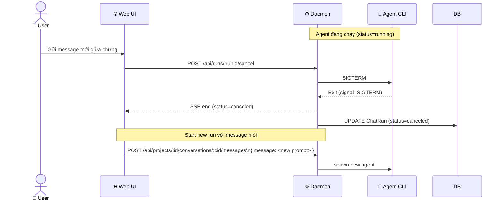
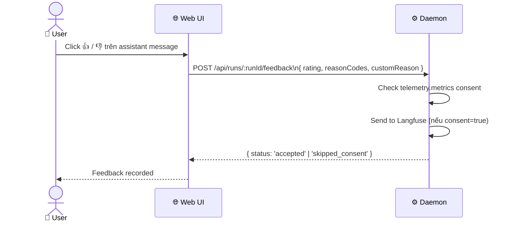

# DF-05: Chat & SSE Streaming Data Flow

**Feature:** Chat Conversation, Agent Streaming, Prompt Stack  
**Actors:** User, Web UI, Daemon, Agent CLI, AI Provider, SQLite DB, Filesystem

---

## 1. Luồng tổng quan: Gửi Message → Nhận Stream



---

## 2. SSE Event Flow Chi tiết



---

## 3. Prompt Stack Assembly

```mermaid
flowchart TD
    subgraph PROMPT_STACK["Prompt Stack (thứ tự inject)"]
        P1[① DISCOVERY directives\nquestion-form, direction-picker]
        P2[② Identity charter\nanti-AI-slop, OFFICIAL_DESIGNER_PROMPT]
        P3[③ Active DESIGN.md\n150+ design systems]
        P4[④ Active SKILL.md\nbody + frontmatter]
        P5[⑤ Project metadata\nkind, platform, fidelity, animations]
        P6[⑥ Skill side files\ntemplate.html + references/*.md]
        P7[⑦ DECK framework\nnav/counter/scroll/print — deck only]
        P8[⑧ Memory entries\nuser/feedback/project/reference]
        P9[⑨ Custom instructions\nuser + project level]

        P1 --> P2 --> P3 --> P4 --> P5 --> P6 --> P7 --> P8 --> P9
    end
```



---

## 4. Redirect Mid-Flight Flow



---

## 5. Conversation Multi-Turn Memory

```mermaid
flowchart LR
    MSG1[Turn 1\nUser + Assistant] --> DB[(SQLite\nChatMessage)]
    MSG2[Turn 2] --> DB
    MSG3[Turn N] --> DB

    DB -->|Reconstruct history| HIST[Message History]
    HIST -->|Include in context| AGENT[Agent next turn]

    subgraph PERSIST["Persisted per message"]
        CONTENT[content: string]
        EVENTS[eventsJson: PersistedAgentEvent]
        FILES[producedFiles: ProjectFile[]]
        TIMING[startedAt/endedAt]
    end
```

---

## 6. Feedback Submission Flow



---

## Data Store Map

| Data | Location | Lifecycle |
|------|----------|-----------|
| `ChatMessage` | SQLite `messages` table | Persist forever |
| `ChatRun` | SQLite `runs` table | Persist, status updated |
| `eventsJson` | SQLite (JSON column) | Persist sau khi run xong |
| `producedFiles` | SQLite + FS listing | Sync từ FS mtime |
| Prompt stack | In-memory per run | Không persist |
| SSE stream | In-memory | Drop khi client disconnect |
