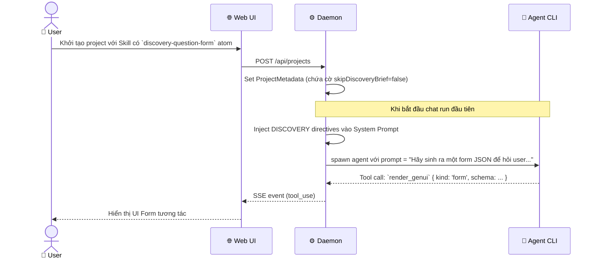
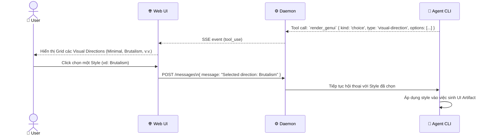
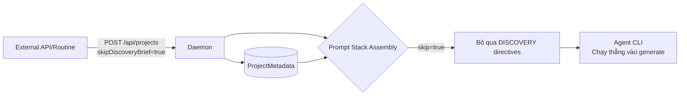

# DF-06: Discovery Form & Direction Picker Data Flow

**Feature:** Discovery Form — Thu thập thông tin requirement đầu vào từ user một cách có cấu trúc trước khi sinh code. Cung cấp Direction Picker để chọn visual direction.  
**Actors:** User, Web UI, Daemon, AI Agent

---

## 1. Discovery Form Injection Flow



---

## 2. User Form Submission Flow

```mermaid
flowchart TD
    U[User điền form] --> W[Web UI]
    W -->|Submit form data| W2[Format data thành Markdown]
    
    W2 -->|POST /messages\n{ message: "Discovery Form Data:\n..." }| D[Daemon]
    
    D --> DB[(SQLite\nChat Message)]
    D --> A[🤖 Agent CLI]
    A -->|Phân tích Data| P[AI Provider]
    P -->|Phản hồi kế hoạch| A
    A -->|Streaming text / Update Artifact| D
    D -->|SSE Stream| W
    W -->|Hiển thị kết quả| U
```

---

## 3. Direction Picker Flow (Visual Styles)



---

## 4. Skip Discovery Flow (Batch / API)



---

## Data Store Map

| Data | Location | Notes |
|------|----------|-------|
| Form Schema | In-memory stream (từ Agent) | Agent tự quyết định schema dựa trên prompt |
| Form Data (submitted) | SQLite `messages` | Lưu dưới dạng text / markdown từ user turn |
| Skip Flag | SQLite `projects.metadataJson` | Dùng để bỏ qua form khi chạy automation |
