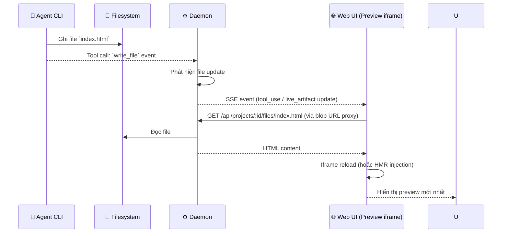
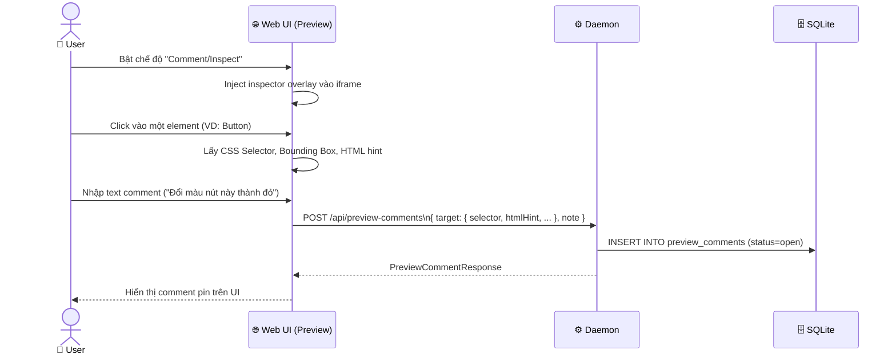
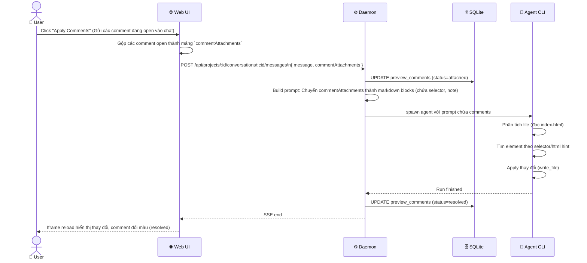

# DF-07: Artifact Rendering & Preview Comments Data Flow

**Feature:** Artifact Rendering (HTML, Deck, Markdown) và Preview Comments (Pod/Element annotation)  
**Actors:** User, Web UI (Renderer iframe), Daemon, Filesystem, AI Agent

---

## 1. Artifact File Synchronization Flow



---

## 2. Preview Comments: Add New Comment



---

## 3. Apply Comments into Chat Flow



---

## 4. Render Types Flow (Mime & Viewers)

```mermaid
flowchart TD
    D[Daemon: Read File] --> CHK{Artifact manifest \n `renderer`?}
    
    CHK -->|html| V_HTML[HTML Iframe\n(có tailwind injection)]
    CHK -->|deck-html| V_DECK[Slide Deck Viewer\n(Reveal.js wrapper)]
    CHK -->|react-component| V_REACT[React Runner\n(Babel in-browser transpile)]
    CHK -->|markdown| V_MD[Markdown Viewer]
    CHK -->|code| V_CODE[Code Editor / Diff View]
    
    V_HTML --> W[Web UI]
    V_DECK --> W
    V_REACT --> W
    V_MD --> W
    V_CODE --> W
```

---

## Data Store Map

| Data | Location | Notes |
|------|----------|-------|
| Artifact Files | Filesystem `.od/projects/<id>/` | Phục vụ trực tiếp qua HTTP route `/:id/files/*` |
| `PreviewComment` | SQLite `preview_comments` | Lưu bounding box, selector, html hint |
| Comment Status | SQLite | Trạng thái: `open`, `attached`, `applying`, `resolved` |
| `ArtifactManifest` | File `artifact.json` hoặc HTML comment | Định nghĩa cách render (renderer) |
