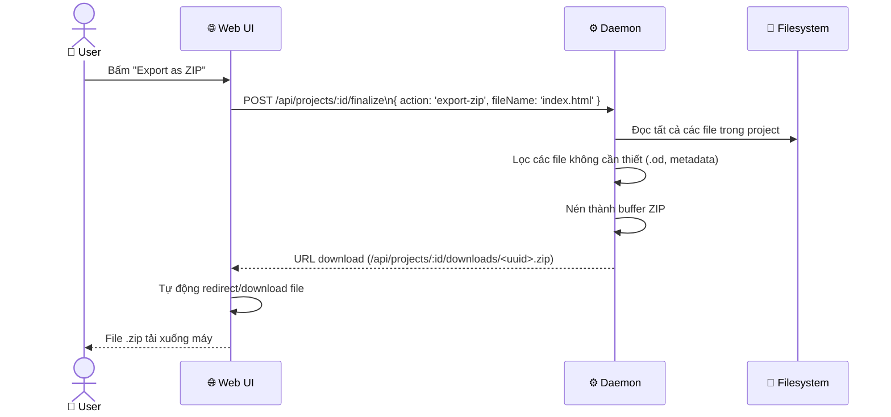
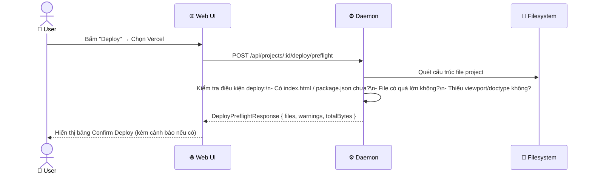
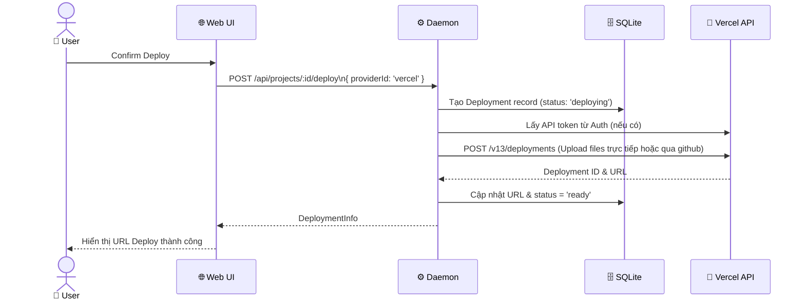
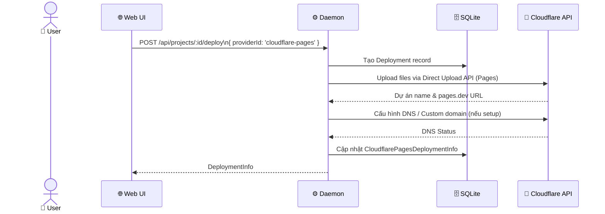
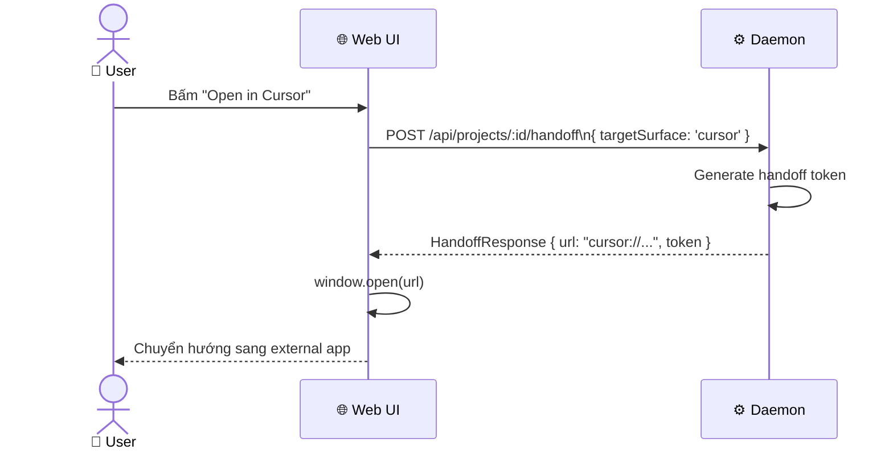

# DF-08: Export & Deploy Data Flow

**Feature:** Export Artifact (ZIP, PDF, PPTX) và Deploy (Vercel, Cloudflare)  
**Actors:** User, Web UI, Daemon, Filesystem, External API (Vercel/Cloudflare)

---

## 1. Export Flow (HTML/React to ZIP)

---

## 2. Deploy Preflight Flow

---

## 3. Deploy to Vercel Flow

---

## 4. Deploy to Cloudflare Pages Flow

---

## 5. Handoff Flow (to Figma / Code Agent)

---

## Data Store Map

| Data | Location | Notes |
|------|----------|-------|
| `DeploymentInfo` | SQLite `deployments` | Tracking URL, provider, status |
| Custom Domain | SQLite (trong `DeploymentInfo`) | Cloudflare DNS record status |
| Export Artifacts | FS `/tmp` hoặc in-memory stream | Bị xóa sau khi download xong |
