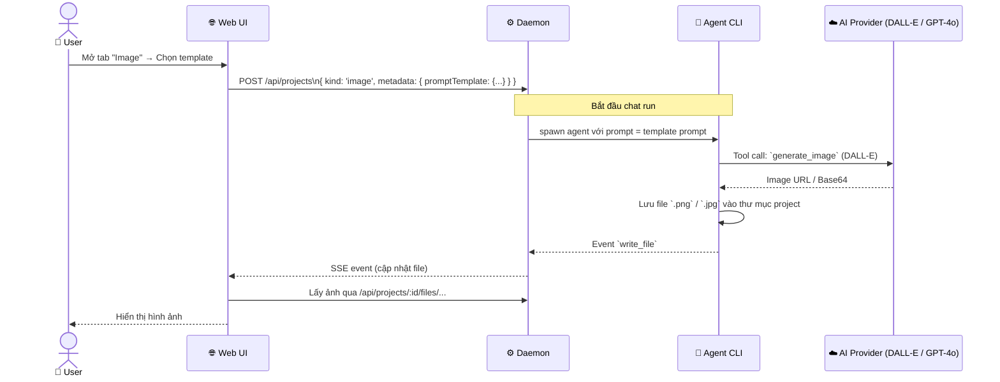
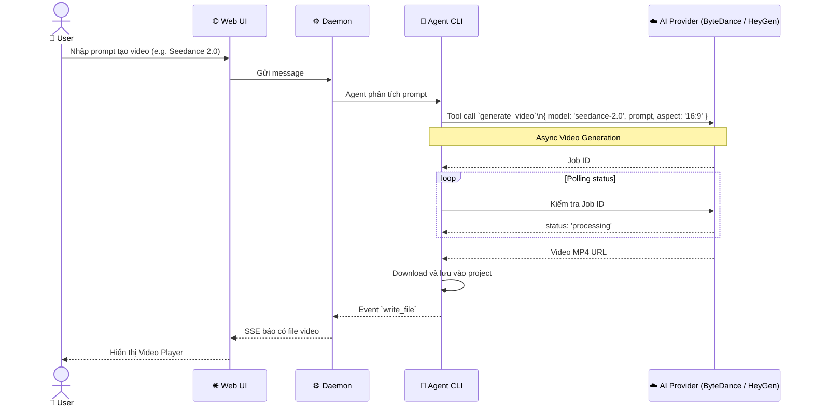
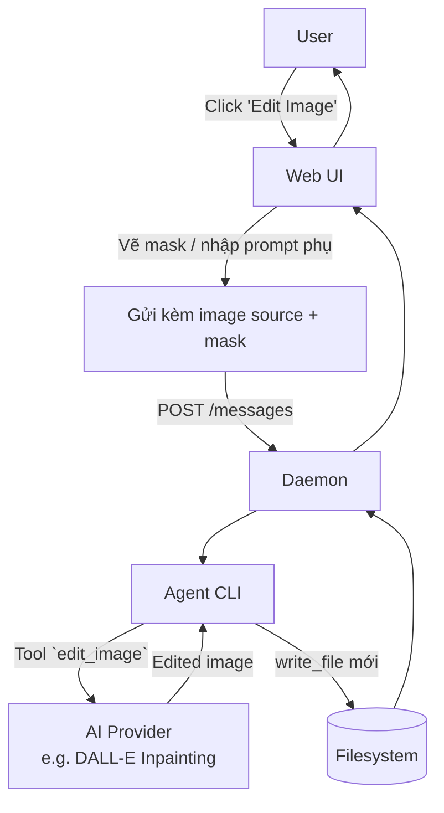

# DF-09: Media Generation Data Flow

**Feature:** Media Generation — Tạo hình ảnh (Image), Video và Audio từ prompt hoặc template  
**Actors:** User, Web UI, Daemon, AI Agent (Media generation tools), Provider API (OpenAI, ByteDance, Fal.ai)

---

## 1. Image Generation Flow

---

## 2. Video Generation Flow (Seedance / HyperFrames)

---

## 3. Image Edit / Variation Flow

---

## Data Store Map

| Data | Location | Notes |
|------|----------|-------|
| Prompt Template | SQLite `projects.metadataJson` | Lấy từ `prompt-templates/{image|video}/` khi tạo |
| Media Files | Filesystem `.od/projects/<id>/` | Images, MP4, MP3 được lưu vật lý |
| API Keys | SQLite `config.json` | Cấu hình trong Settings → Media Providers |
