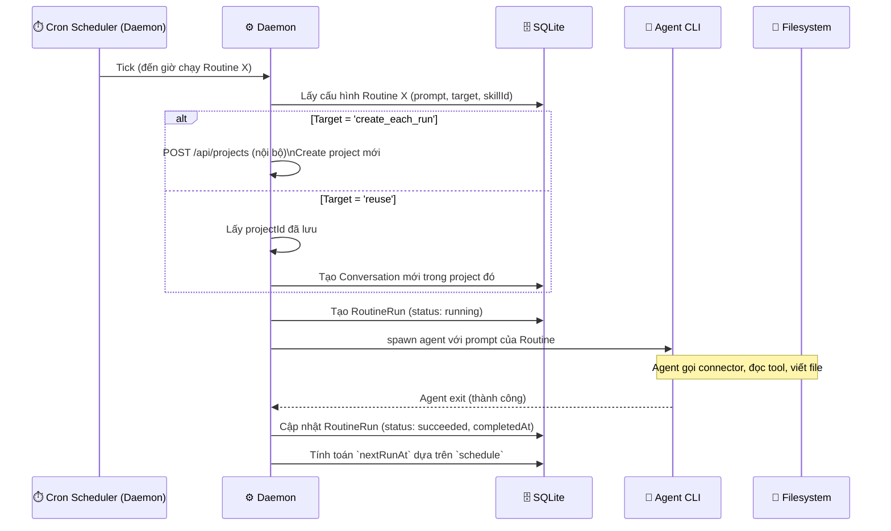
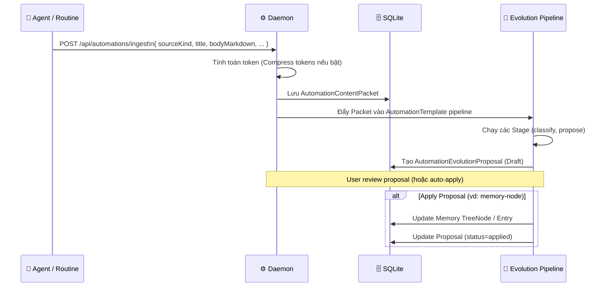

# DF-10: Routines & Automation Data Flow

**Feature:** Routines (Lịch chạy định kỳ) & Automations (Pipeline tự động)  
**Actors:** Daemon (Scheduler), SQLite DB, Agent CLI, Connector API

---

## 1. Routine Execution Flow (Scheduled)



---

## 2. Orbit Flow (Daily Digest Automation)

```mermaid
flowchart TD
    S[Cron tick (daily at HH:mm)] --> CHK{Orbit enabled?}
    CHK -->|No| STOP[Bỏ qua]
    CHK -->|Yes| PULL[Kích hoạt Connector Sync]
    
    PULL --> C_CAL[Lấy Calendar events]
    PULL --> C_MAIL[Lấy Unread Emails]
    PULL --> C_GH[Lấy GitHub Notifications]
    
    C_CAL --> AG[Aggregate data]
    C_MAIL --> AG
    C_GH --> AG
    
    AG --> PROJ[Tạo Project mới\n(Skill: Daily Orbit)]
    PROJ --> AGENT[Chạy Agent tóm tắt thông tin]
    AGENT --> ART[Tạo Dashboard Live Artifact]
```

---

## 3. Automation Data Ingestion (Memory/Evolution)

Khi Routine (hoặc thao tác thủ công) "crystallize" một packet data để đưa vào Automation Pipeline:



---

## Data Store Map

| Data | Location | Notes |
|------|----------|-------|
| `Routine` | SQLite `routines` | Cấu hình lịch (hourly, daily, weekly), target project |
| `RoutineRun` | SQLite `routine_runs` | Tracking lịch sử mỗi lần chạy |
| `AppConfig.orbit` | SQLite `config.json` | Cấu hình Orbit (time, enabled) |
| `AutomationTemplate` | SQLite `automation_templates` | Blueprint pipeline |
| `AutomationContentPacket` | SQLite | Raw data ingest vào hệ thống |
| `EvolutionProposal` | SQLite `automation_proposals` | Đề xuất chỉnh sửa từ AI chờ user duyệt |
