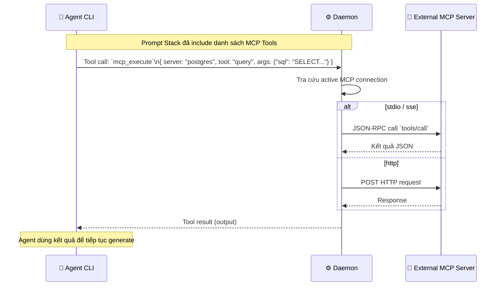
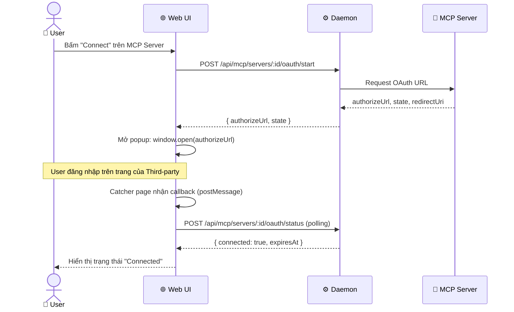

# DF-11: MCP Integration Data Flow

**Feature:** Model Context Protocol (MCP) — Giao tiếp với các external tool servers (File, DB, APIs)  
**Actors:** User, Web UI, Daemon, External MCP Server (stdio/sse/http), Agent CLI

---

## 1. Connect & Configure MCP Server Flow

```mermaid
flowchart TD
    U[User] -->|Nhập cấu hình MCP Server| W[Web UI\nSettings → MCP]
    W -->|POST /api/mcp/servers| D[Daemon]
    
    D --> DB[(SQLite\nconfig.json)]
    DB -->|Lưu cấu hình| D
    
    D --> CHK{Transport type?}
    CHK -->|stdio| STD[Spawn child process\n(VD: npx -y @modelcontextprotocol...)]
    CHK -->|sse| SSE[Mở kết nối SSE client]
    CHK -->|http| HTTP[Ping healthcheck endpoint]
    
    STD --> INIT[Gửi message `initialize`]
    SSE --> INIT
    HTTP --> INIT
    
    INIT --> RES[Nhận Capabilities\n(Tools, Prompts, Resources)]
    RES --> WS[Broadcast state\n(connected)]
```

---

## 2. MCP Tool Execution (During Chat Run)



---

## 3. MCP OAuth Flow (Auth Mode = oauth)

Đối với các MCP server yêu cầu xác thực user riêng (VD: Google Drive MCP).



---

## Data Store Map

| Data | Location | Notes |
|------|----------|-------|
| `McpConfig` | SQLite `config.json` | Chứa command, url, môi trường env của các server |
| MCP Active Conns | In-memory (Daemon) | Process reference (stdio) hoặc EventSource (sse) |
| OAuth Tokens | Local Storage / Config | Do Third-party quản lý hoặc Daemon giữ tuỳ protocol |
| MCP Templates | Built-in (Mã nguồn) | Catalog các server có sẵn (Settings → MCP → Add) |
