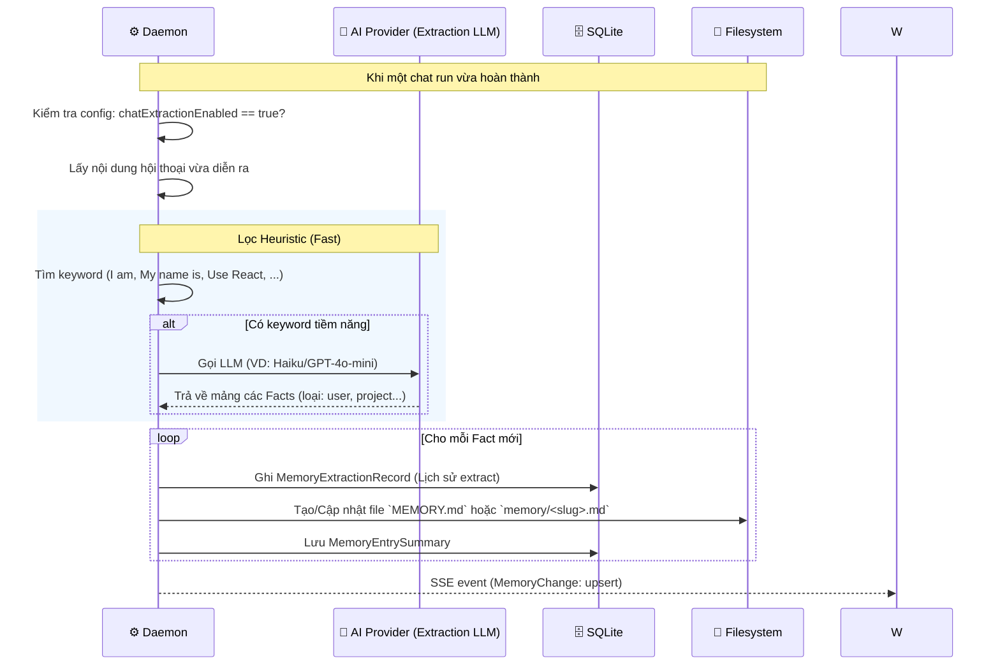
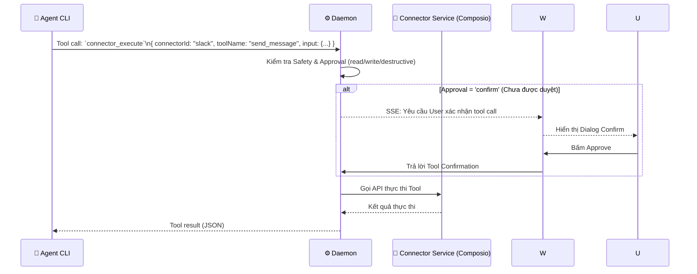

# DF-12: Memory & Connectors Data Flow

**Feature:** Memory System (Fact extraction) & Connectors (Composio, third-party auth)  
**Actors:** User, Web UI, Daemon, AI Agent (Heuristic/LLM Extractor), SQLite DB, Filesystem, External Connectors (Composio, OAuth)

---

## 1. Memory Extraction Flow (Post-Chat)



---

## 2. Connectors Integration Flow (Composio / Native)

```mermaid
flowchart TD
    U[User] -->|Mở Connectors UI| W[Web UI]
    W -->|GET /api/connectors| D[Daemon]
    
    D --> DB[(SQLite\nConfig)]
    DB --> D
    D --> API[Composio API / Native Providers]
    API --> D
    
    D --> RES[ConnectorDetailResponse]
    RES --> W
    
    W -->|Bấm Connect (VD: Slack)| AUTH[OAuth Flow]
    AUTH -->|Callback| D
    D -->|Lưu Provider Token| DB
```

---

## 3. Connector Tool Execution (By Agent)



---

## 4. Automation: Connector to Memory Flow

Routine tự động lấy dữ liệu từ Connector và đẩy vào Memory (hoặc tạo Artifact).

```mermaid
flowchart LR
    S[Cron Routine] -->|Trigger| D[Daemon]
    D -->|Execute| C[Connector\n(e.g., Gmail/Notion)]
    C -->|Lấy Data mới| D
    
    D --> ING[Ingestion Pipeline\n(Token Compression)]
    ING --> PACKET[(AutomationContentPacket)]
    
    PACKET --> EV[Evolution Pipeline]
    EV -->|LLM Propose| PROP[Memory Node Proposal]
    
    PROP -->|Auto-apply (if set)| MEM[(Memory Store)]
```

---

## Data Store Map

| Data | Location | Notes |
|------|----------|-------|
| `MemoryEntry` | Filesystem `memory/` (Markdown) | Chứa Frontmatter định danh, nội dung text |
| `MemorySummary` | SQLite (Cache) | Giúp list nhanh không cần đọc đĩa |
| `ExtractionRecord` | SQLite `memory_extractions` | Tracking lịch sử chạy auto-extract |
| Connector Config | SQLite `config.json` | Status connect, token (nếu native), provider type |
| `ConnectorToolDetail` | In-memory / Remote | Cấu hình an toàn của từng tool (read/write/destructive) |
