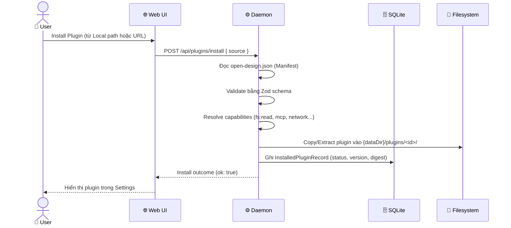
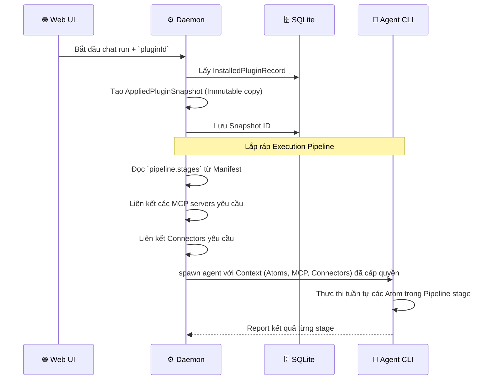
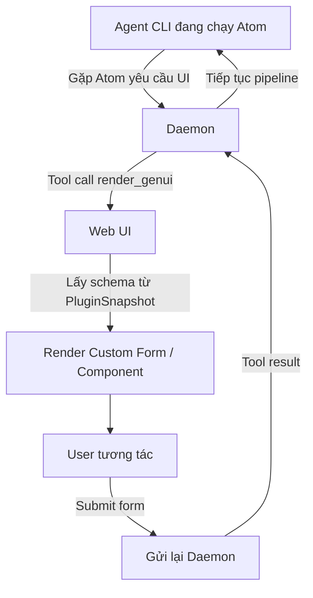

# DF-13: Plugin System Data Flow

**Feature:** Hệ thống Plugin (Manifest v1) mở rộng tính năng của Open Design  
**Actors:** User, Web UI, Daemon, SQLite DB, Filesystem, Agent CLI

---

## 1. Plugin Install Flow

---

## 2. Apply Plugin to Project Run

Khi User bắt đầu một project mới hoặc một run mới với một plugin cụ thể.

---

## 3. GenUI (Plugin UI) Flow

Plugin có thể định nghĩa các form / UI tuỳ chỉnh qua `genui.surfaces`.

---

## Data Store Map

| Data | Location | Notes |
|------|----------|-------|
| `InstalledPluginRecord` | SQLite `installed_plugins` | Trạng thái cài đặt hiện tại trên máy |
| Plugin Files | Filesystem `{dataDir}/plugins/<id>/` | Mã nguồn/tài sản của plugin (open-design.json) |
| `AppliedPluginSnapshot` | SQLite `plugin_snapshots` | Bản sao bất biến lúc plugin được chạy (chống trôi dạt version) |
