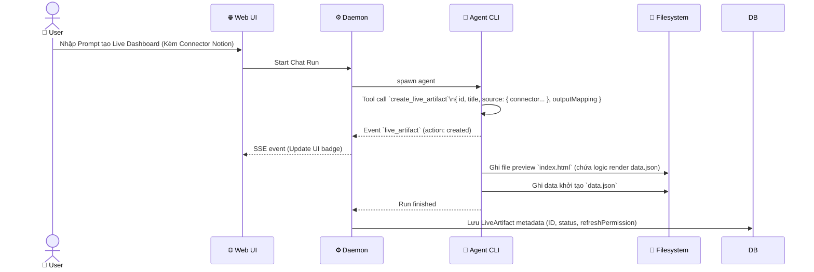
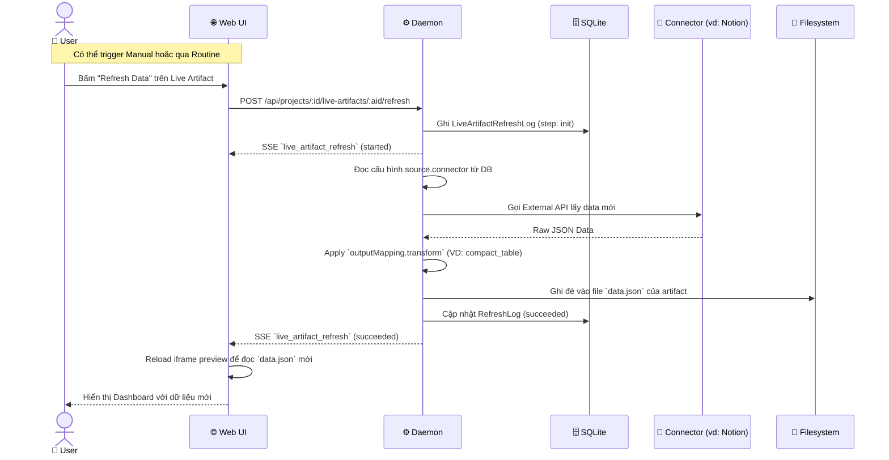

# DF-14: Live Artifacts Data Flow

**Feature:** Live Artifacts — Các artifact có khả năng tự động cập nhật dữ liệu (Refreshable) thông qua Connector hoặc Tool.  
**Actors:** User, Web UI, Daemon, Filesystem, External API (Connectors), SQLite DB

---

## 1. Live Artifact Creation Flow



---

## 2. Live Artifact Refresh Flow

Quy trình cập nhật dữ liệu (Refresh) của một Live Artifact.



---

## 3. Data Transformation Flow

```mermaid
flowchart TD
    RAW[Raw API Data\n(Từ Connector)] --> CHK{Transform?}
    
    CHK -->|identity| RES_IDENT[Giữ nguyên JSON]
    CHK -->|compact_table| RES_COMPACT[Biến đổi mảng object thành mảng 2D headers/rows]
    CHK -->|metric_summary| RES_METRIC[Chỉ lấy các số liệu chính]
    
    RES_IDENT --> SAVE[Lưu vào data.json]
    RES_COMPACT --> SAVE
    RES_METRIC --> SAVE
```

---

## Data Store Map

| Data | Location | Notes |
|------|----------|-------|
| `LiveArtifact` Metadata | SQLite `live_artifacts` | Trạng thái pin, status, refreshPermission |
| Refresh Logs | SQLite `live_artifact_refresh_logs` | Tracking lịch sử mỗi lần refresh |
| Preview File | Filesystem `.od/projects/<id>/<artifactId>.html` | File render giao diện |
| Data File | Filesystem `.od/projects/<id>/<artifactId>.json` | Dữ liệu data.json thực tế (được ghi đè liên tục) |
