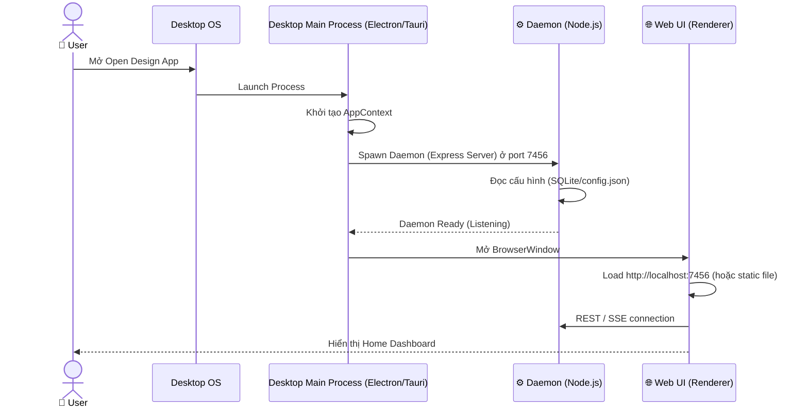
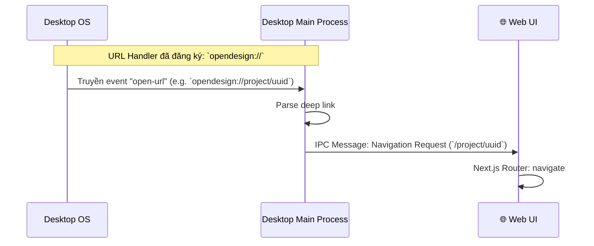
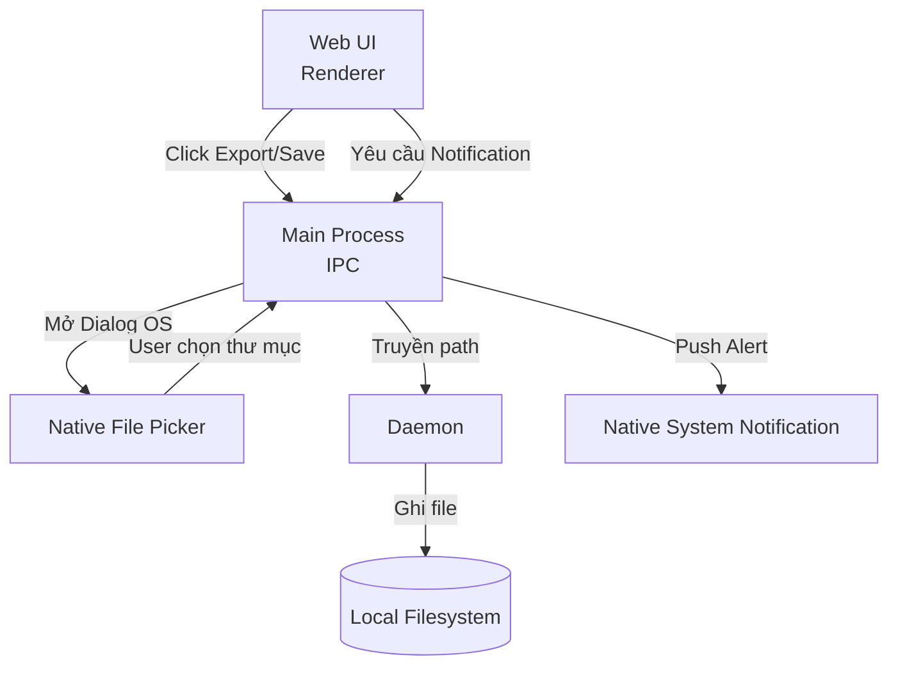

# DF-15: Desktop App Data Flow

**Feature:** Desktop App Wrapper — Electron/Tauri bọc Next.js (Web UI) và Node.js (Daemon)  
**Actors:** User, Desktop OS, Web UI (Frontend Window), Daemon (Background Process)

---

## 1. Application Startup Flow

---

## 2. Deep Linking / Handoff Flow

---

## 3. Desktop Native Integration Flow

---

## Data Store Map

| Data | Location | Notes |
|------|----------|-------|
| App Config | `~/.od/config.json` hoặc `%APPDATA%` | Shared state cho cả Web UI, Daemon và Desktop App |
| Database | `~/.od/app.sqlite` | Shared data |
| Project Files | `~/.od/projects/` | File lưu nội bộ của App |
