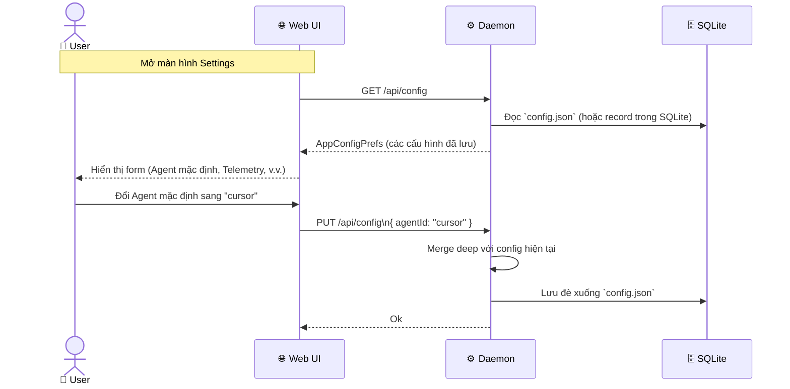
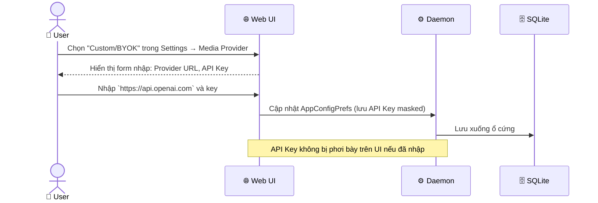

# DF-16: Settings & Configuration Data Flow

**Feature:** Quản lý cấu hình Settings toàn cục (Agents, Models, MCP, Skills, Media Providers, Telemetry)  
**Actors:** User, Web UI, Daemon, SQLite DB

---

## 1. Preferences Loading & Saving



---

## 2. Telemetry / Metrics Data Flow

Theo dõi người dùng và lưu lượng, được bật qua `telemetry.metrics`.

```mermaid
flowchart TD
    U[User Tương tác\nVD: Submit Prompt] -->|Web UI Track| D[Daemon]
    
    D --> CHK{Telemetry Enabled?}
    CHK -->|False| STOP[Drop sự kiện]
    CHK -->|True| EVENT[Chuẩn hóa Event\n(Xóa PII, Mask data)]
    
    EVENT --> BATCH[Batch Event Queue]
    BATCH -->|Định kỳ| POSTHOG[PostHog API\n(Analytics Server)]
    
    POSTHOG --> METRICS[Dashboard Thống kê\n(Phía Backend System)]
```

---

## 3. Media Provider (BYOK) Setup



---

## Data Store Map

| Data | Location | Notes |
|------|----------|-------|
| `AppConfigPrefs` | `~/.od/config.json` (hoặc DB row) | Toàn bộ settings (agent cli, orbit, telemetry) |
| API Keys | Tương tự | Lưu plain text (hoặc encrypt nhẹ) ở phía Daemon |
| Default Agent | `AppConfigPrefs.agentId` | Dùng khi user tạo project không chỉ định Agent |
