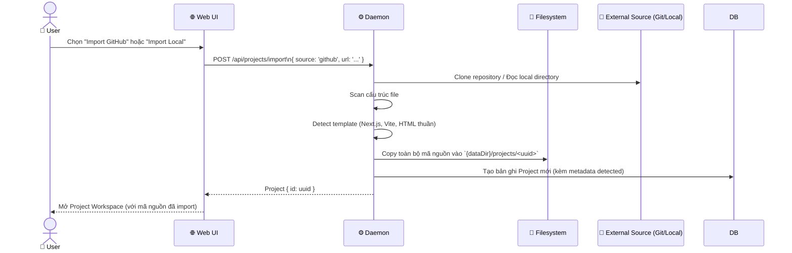
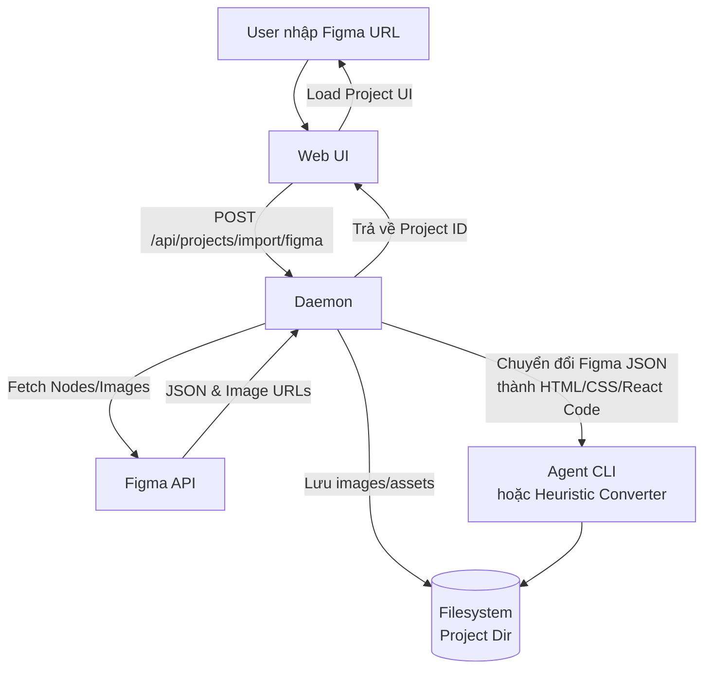
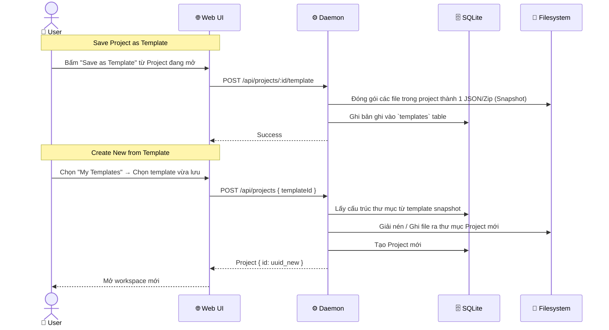

# DF-17: Import & Templates Data Flow

**Feature:** Import/Template — Nhập dự án từ nguồn bên ngoài (Figma, GitHub, Local Code) và quản lý Template cá nhân  
**Actors:** User, Web UI, Daemon, Filesystem, SQLite DB, External Service (GitHub/Figma)

---

## 1. Import from Source (GitHub / Local)

---

## 2. Figma Import (Design to Code Flow)

---

## 3. Custom Templates Flow (Save & Reuse)

User có thể lưu lại 1 project bất kỳ làm "Template" để tái sử dụng.

---

## Data Store Map

| Data | Location | Notes |
|------|----------|-------|
| Import Data | Filesystem `projects/<id>` | Toàn bộ repo Git, files Local đều được copy vào OD filesystem |
| Templates | SQLite `templates` | Snapshot file dưới dạng JSON (nếu nhỏ) hoặc lưu file ZIP trong thư mục ẩn |
| Figma Assets | Filesystem `projects/<id>/assets` | Hình ảnh kéo từ Figma về lưu local để Agent/Code refer |
