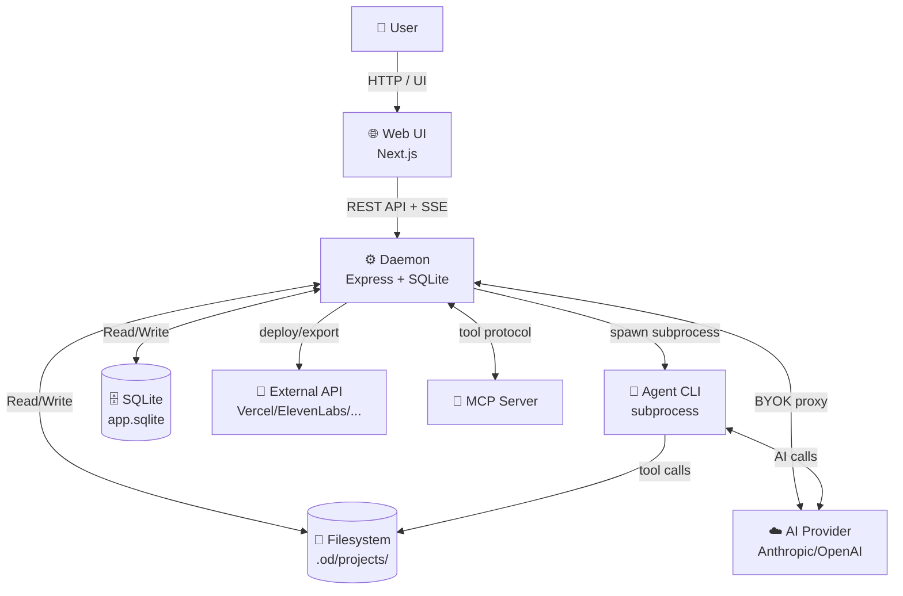

# Data Flows — Open Design VNPay

> **Mục đích:** Mô tả luồng dữ liệu (Data Flow) cho từng tính năng, với đầy đủ các **Actors**, **Data Stores**, và **Processes**.
> **Ký hiệu:** Sử dụng Mermaid sequenceDiagram và flowchart để visualize.

---

## Actors (Đối tượng tham gia)

| Actor | Ký hiệu | Mô tả |
|-------|---------|-------|
| **User** | `U` | Người dùng cuối tương tác với Web UI |
| **Web UI** | `W` | Next.js frontend (browser) |
| **Daemon** | `D` | Local Express server (port 7456) |
| **Agent CLI** | `A` | AI agent subprocess (Claude Code, Cursor, v.v.) |
| **AI Provider** | `P` | API backend (Anthropic, OpenAI, Azure, Google) |
| **SQLite DB** | `DB` | `.od/app.sqlite` — persisted state |
| **Filesystem** | `FS` | `.od/projects/<id>/` — project files on disk |
| **External API** | `EX` | Third-party services (Vercel, Cloudflare, ElevenLabs, ByteDance, Composio) |
| **MCP Server** | `MCP` | External MCP tool server (stdio/http/sse) |

---

## Danh mục Data Flows

| # | File | Feature |
|---|------|---------|
| 01 | [DF-01-agent-system.md](./DF-01-agent-system.md) | Agent System & BYOK |
| 02 | [DF-02-skills-system.md](./DF-02-skills-system.md) | Skills System |
| 03 | [DF-03-design-systems.md](./DF-03-design-systems.md) | Design Systems Library |
| 04 | [DF-04-project-management.md](./DF-04-project-management.md) | Project Management |
| 05 | [DF-05-chat-streaming.md](./DF-05-chat-streaming.md) | Chat & SSE Streaming |
| 06 | [DF-06-discovery-form.md](./DF-06-discovery-form.md) | Discovery Form & Direction Picker |
| 07 | [DF-07-artifact-rendering.md](./DF-07-artifact-rendering.md) | Artifact Rendering & Preview Comments |
| 08 | [DF-08-export-deploy.md](./DF-08-export-deploy.md) | Export & Deploy |
| 09 | [DF-09-media-generation.md](./DF-09-media-generation.md) | Media Generation (Image/Video/Audio) |
| 10 | [DF-10-routines-automation.md](./DF-10-routines-automation.md) | Routines & Automation |
| 11 | [DF-11-mcp-integration.md](./DF-11-mcp-integration.md) | MCP Integration |
| 12 | [DF-12-memory-connectors.md](./DF-12-memory-connectors.md) | Memory & Connectors |
| 13 | [DF-13-plugin-system.md](./DF-13-plugin-system.md) | Plugin System |
| 14 | [DF-14-live-artifacts.md](./DF-14-live-artifacts.md) | Live Artifacts |
| 15 | [DF-15-desktop-app.md](./DF-15-desktop-app.md) | Desktop Application |
| 16 | [DF-16-settings-config.md](./DF-16-settings-config.md) | Settings & Configuration |
| 17 | [DF-17-import-templates.md](./DF-17-import-templates.md) | Import & Templates |

---

## Luồng tổng quan hệ thống

